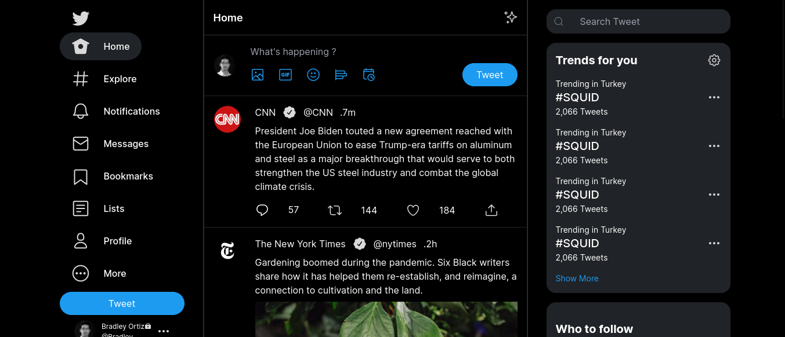

# KADEA ACADEMY | x-twitter-clone | SOLUTION

## Overview



### Links

- ☑ Solution URL: [Solution URL](https://github.com/BirushaNdegeya/x-twitter-clone)
- ☑ Live Site URL: [Live Site URL](https://x-twitter-myclone.vercel.app/)

## My process

### Built with

- ☑ Semantic HTML5 markup
- ☑ Mobile-first workflow
- ☑ [React-router-dom](https://reactrouter.com/en/main/start/tutorial) - Routing Library
- ☑ [React](https://reactjs.org/) - JS library
- ☑ [Tailwindcss]() - CSS Framework

### What I learned

When creating the X Twitter/clone React project provided by KADEA ACADEMY, I gained valuable insights into leveraging the power of React.js to build dynamic and scalable web applications.

One of the fundamental concepts I learned was the effective use of props to facilitate communication between parent and child components. By passing data through props, I was able to seamlessly transmit information from higher-level components to their nested children, enhancing modularity and maintainability within the application's architecture.

Moreover, I discovered the importance of reusability in React development. Through the creation of reusable components, I optimized my workflow and minimized redundant code across the project. This approach not only streamlined development but also fostered consistency and coherence throughout the application.

By harnessing the flexibility of React components, I could efficiently integrate common functionalities across different parts of the website. This practice allowed me to avoid reinventing the wheel and focus more on implementing unique features and enhancing user experience.

In essence, my experience with the X Twitter/clone React project underscored the significance of modular design, effective data management, and component reusability in React.js development. These principles have not only enriched my understanding of React but also equipped me with valuable tools to tackle complex web development challenges in future projects.

```js

import React from "react";
import Tweet from './Tweet';
import { postData } from '../../data/PostData';

const Tweets = () => {
   return (
      <div className="tweets">
         { 
            postData.map((tweet) => (
               <Tweet
                  key={tweet.id}
                  userPhoto={tweet.logo} 
                  name={tweet.name} 
                  nameTwitter={tweet.twitterName} 
                  datePost={tweet.lastedTime}
                  reply={tweet.likeText}
                  retweet={tweet.commentText}
                  love={tweet.loveText} 
                  desc={tweet.bodyText}
                  URL={tweet?.img}
               />
            ))
            }
      </div>
   );
};

export default Tweets;

```

### Continued development

I am transitioning towards building all of my websites using the React JavaScript Library, while adhering to the Google Material Design principles. This shift enables me to leverage the powerful capabilities of React for efficient development, while also ensuring that my designs align with the established usability and aesthetic standards advocated by Google's Material Design principles.

### Useful resources

- ☑ [React](https://reactjs.org/) - JS library

## Author

- ☑ Frontend Mentor - [@BirushaNdegeya](https://www.frontendmentor.io/profile/BirushaNdegeya)
- ☑ Twitter - [@BirushaNdegeya](https://twitter.com/BNdegeya62741)
- ☑ LinkedIn - [BirushaNdegeya](https://www.linkedin.com/in/birusha-ndegeya-243b032a9)

## Acknowledgments

It's truly invaluable to have mentors like Abel MBULA, Josue Makuta, and Thierry Bakera who dedicate themselves to teaching and sharing knowledge about technologies every day. Their commitment to providing real-life projects, such as the Twitter clone using cutting-edge technology like React, demonstrates their dedication to hands-on learning and practical application. With mentors like Abel, Josue, and Thierry, learners like yourself have the opportunity to not only gain theoretical knowledge but also immerse themselves in real-world scenarios, honing their skills and gaining practical experience. Their guidance and mentorship are instrumental in shaping your understanding of technology and preparing you for the challenges of the modern tech landscape.