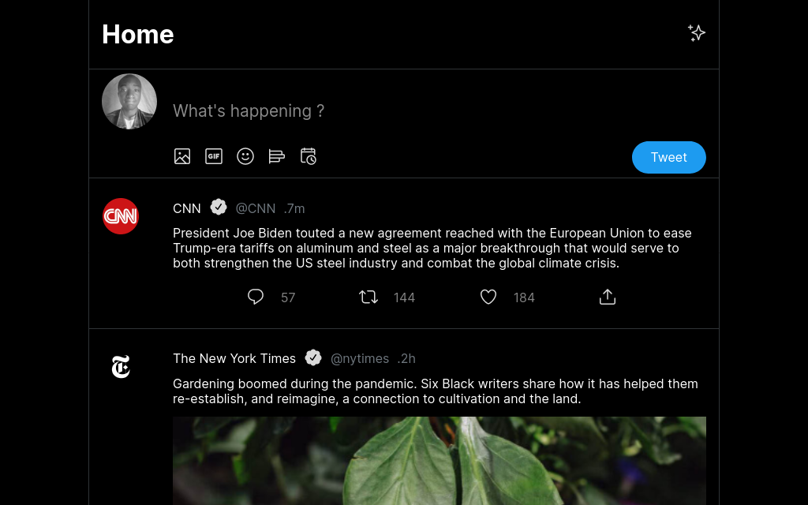

# KADEA ACADEMY - X Twitter/Clone solution

## Overview

### Screenshot



### Links

- Solution URL: [MySolutionURL](https://github.com/BirushaNdegeya/x-twitter-clone)
- Live Site URL: [LiveSiteURL](https://x-twitter-myclone.vercel.app/)

## My process

### Built with

- Semantic HTML5 markup
- CSS custom properties
- Flexbox
- CSS Grid
- Mobile-first workflow
- [React](https://reactjs.org/) - JS library
- [Styled Components](https://styled-components.com/) - For styles

### What I learned

When creating the X Twitter/clone React project provided by KADEA ACADEMY, I gained valuable insights into leveraging the power of React.js to build dynamic and scalable web applications.

One of the fundamental concepts I learned was the effective use of props to facilitate communication between parent and child components. By passing data through props, I was able to seamlessly transmit information from higher-level components to their nested children, enhancing modularity and maintainability within the application's architecture.

Moreover, I discovered the importance of reusability in React development. Through the creation of reusable components, I optimized my workflow and minimized redundant code across the project. This approach not only streamlined development but also fostered consistency and coherence throughout the application.

By harnessing the flexibility of React components, I could efficiently integrate common functionalities across different parts of the website. This practice allowed me to avoid reinventing the wheel and focus more on implementing unique features and enhancing user experience.

In essence, my experience with the X Twitter/clone React project underscored the significance of modular design, effective data management, and component reusability in React.js development. These principles have not only enriched my understanding of React but also equipped me with valuable tools to tackle complex web development challenges in future projects.

```html

   <head>
      <meta charset="utf-8" />
      <link rel="icon" type="image/svg+xml" href="./public/assets/Twitter.svg" />
      <meta name="viewport" content="width=device-width, initial-scale=1.0" />
      <title>x | twitter clone</title>
   </head>
   <body>
      <div id="root"></div>
      <script type="module" src="/src/main.jsx"></script>
   </body>
```
```js

import React from "react";
import Tweet from './Tweet';
import { postData } from '../../data/PostData';

const Tweets = () => {
   return (
      <div className="tweets">
         { 
            postData.map((tweet) => (
               <Tweet
                  key={tweet.id}
                  userPhoto={tweet.logo} 
                  name={tweet.name} 
                  nameTwitter={tweet.twitterName} 
                  datePost={tweet.lastedTime}
                  reply={tweet.likeText}
                  retweet={tweet.commentText}
                  love={tweet.loveText} 
                  desc={tweet.bodyText}
                  URL={tweet?.img}
               />
            ))
            }
      </div>
   );
};

export default Tweets;

```

### Continued development

I am transitioning towards building all of my websites using the React JavaScript Library, while adhering to the Google Material Design principles. This shift enables me to leverage the powerful capabilities of React for efficient development, while also ensuring that my designs align with the established usability and aesthetic standards advocated by Google's Material Design principles.

### Useful resources

- [MDN JavaScript](https://www.example.com) - This helped me for XYZ reason. I really liked this pattern and will use it going forward.
- [Example resource 2](https://www.example.com) - This is an amazing article which helped me finally understand XYZ. I'd recommend it to anyone still learning this concept.

**Note: Delete this note and replace the list above with resources that helped you during the challenge. These could come in handy for anyone viewing your solution or for yourself when you look back on this project in the future.**

## Author

- Website - [Add your name here](https://www.your-site.com)
- Frontend Mentor - [@yourusername](https://www.frontendmentor.io/profile/yourusername)
- Twitter - [@yourusername](https://www.twitter.com/yourusername)

**Note: Delete this note and add/remove/edit lines above based on what links you'd like to share.**

## Acknowledgments

This is where you can give a hat tip to anyone who helped you out on this project. Perhaps you worked in a team or got some inspiration from someone else's solution. This is the perfect place to give them some credit.

**Note: Delete this note and edit this section's content as necessary. If you completed this challenge by yourself, feel free to delete this section entirely.**
